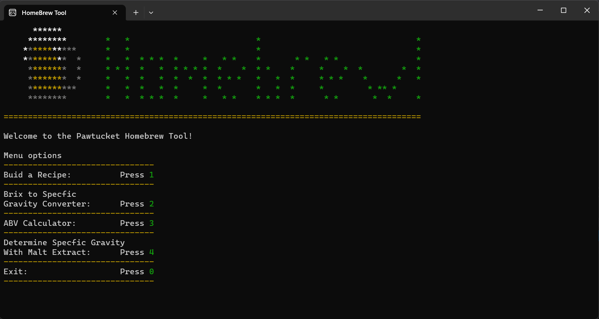
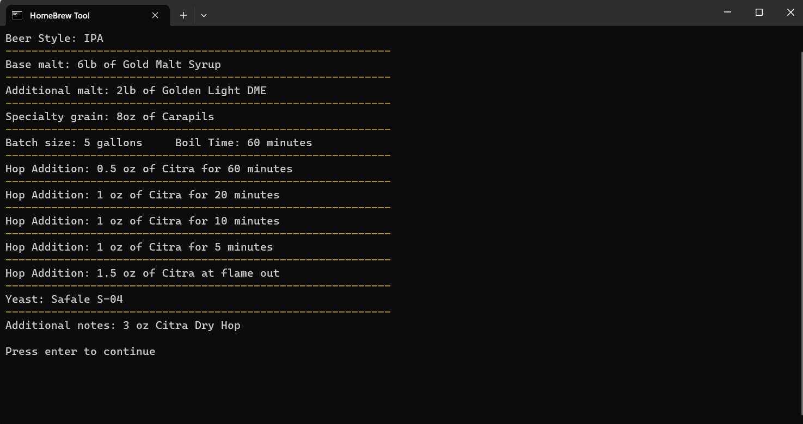

# HomeBrew Tool
## Developer: Jody VanHoose
### Check out my <a href="https://www.linkedin.com/in/jody-vanhoose/" target="_blank">LinkedIn</a>
### Portfolio website: <a href="https://www.jodyvanhoose.com" target="_blank">www.jodyvanhoose.com</a>

## About
### Pollen count web application
The homebrew tool is a C# console application that can help build home brew recipes for beer and mead. It also can calculate ABV(alcohol by volume), convert Brix to Specfic Gravity, and determine Specfic Gravity from amount and type of malt extract. This app was developed for the software development track of the boot camp <a href="http://codekentucky.org/" target="_blank">Code Kentucky</a> in which I am enrolled.

### Screenshot

___
### Key Features
* Easy to navigate UI
* Builds and displays home brew recipes for:
    * Extract Beer
    * All Grain Beer
    * Mead
* Home brew tools:
    * ABV calculator using Brix or Specfic Gravity
    * Brix to Specfic Gravity converter
    * Specfic Gravity by malt extract calculator
___
### Technologies/Languages/Libraries
* C#
* .NET
* Console Application
* Spectre.Console Library
___
### Required Features for Code KY
* Create at least one class (not including the default class in a new project), then create at least one object of that class and populate it with data.
* Create and call at least 3 functions or methods, at least one of which must return a value that is used in your application.

### Additional Required Features (3 or more additional features)
* Implement a “master loop” console application where the user can repeatedly enter commands/perform actions, including choosing to exit the program
* Create an additional class which inherits one or more properties from its parent
* Create a dictionary or list, populate it with several values, retrieve at least one value, and use it in your program
* Create 3 or more unit tests for your application
* Build a conversion tool that converts user input to another type and displays it (ex: converts Brix to Specfic Gravity)

